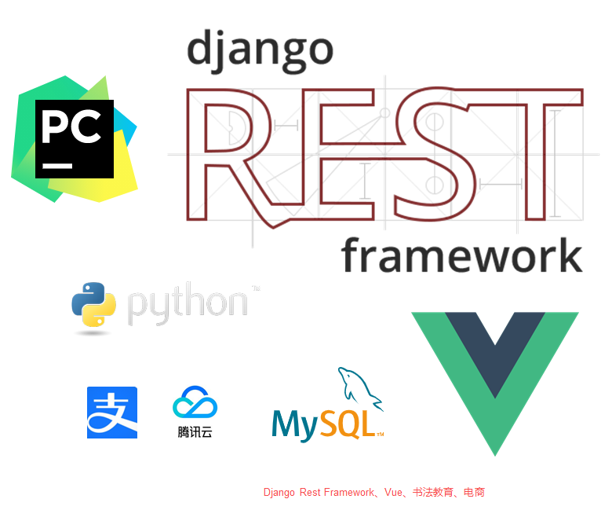

# 项目介绍

前后端分离的书法教育平台，使用Django+Vue进行开发，实现了商品购买，视频播放等功能

# 涉及技术点

| 技术            | Description            |官网|
|---------------|------------------------| ------ |
| Django REST framework | Django REST 框架是用于构建 Web API 的强大而灵活的工具包 | https://www.django-rest-framework.org/ |
| Vue           | 一套用于构建用户界面的渐进式框架       | https://cn.vuejs.org/v2/guide/ |
| 腾讯云短信服务       | 腾讯云短信SDK（Python）       | https://github.com/TencentCloud/tencentcloud-sdk-python |
| simpleui| django admin现代化主题                       | https://github.com/newpanjing/simpleui       |
|Element|    前端UI框架|    https://element.eleme.io|
|Axios |    前端HTTP框架 |    https://github.com/axios/axios|

# 如何使用

# License
[Apache License 2.0](LICENSE)

Copyright (c) 2019-2022 stanedward1
